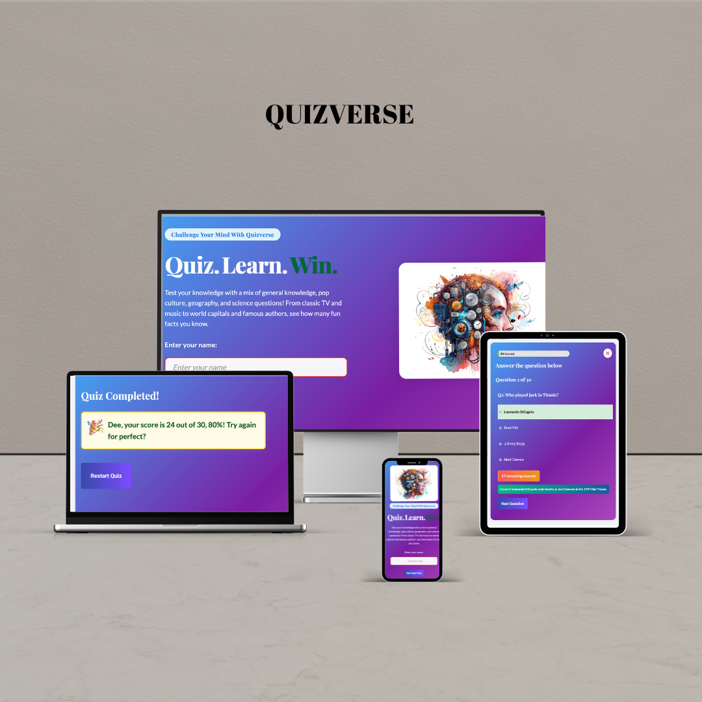
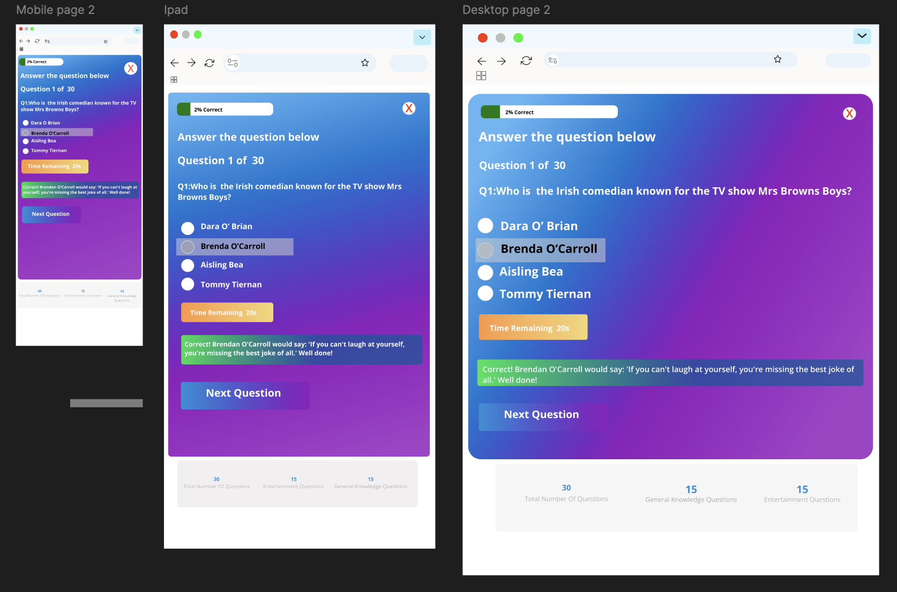
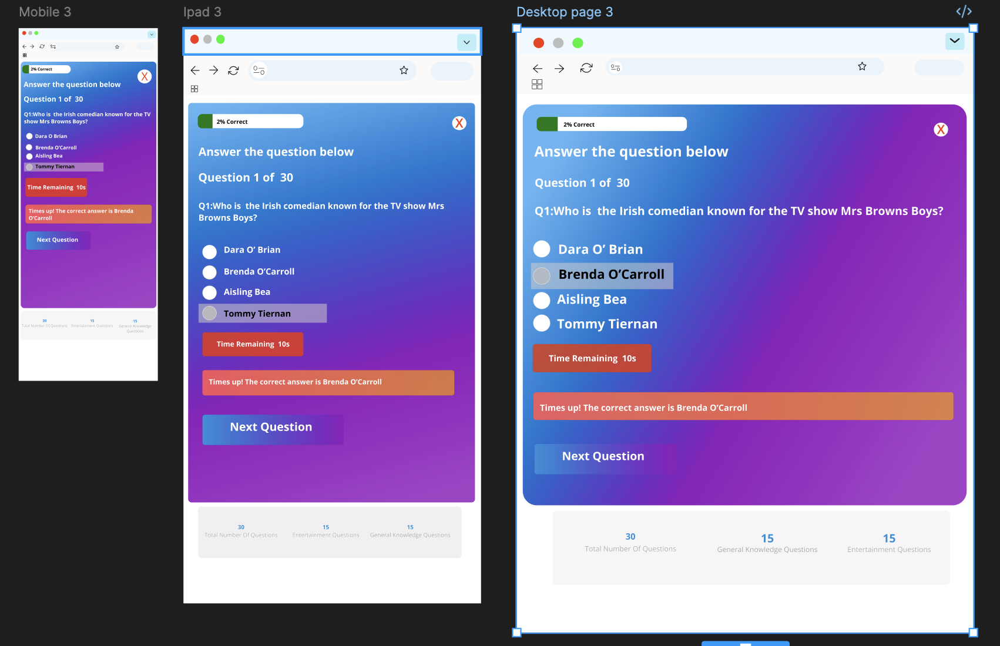
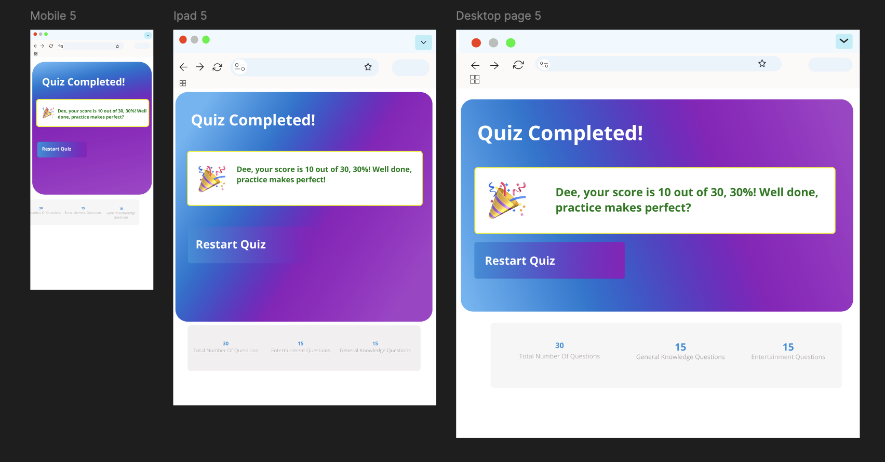
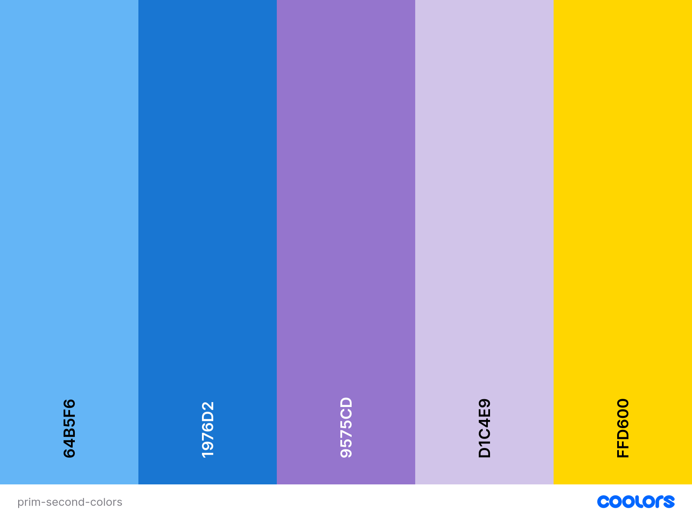
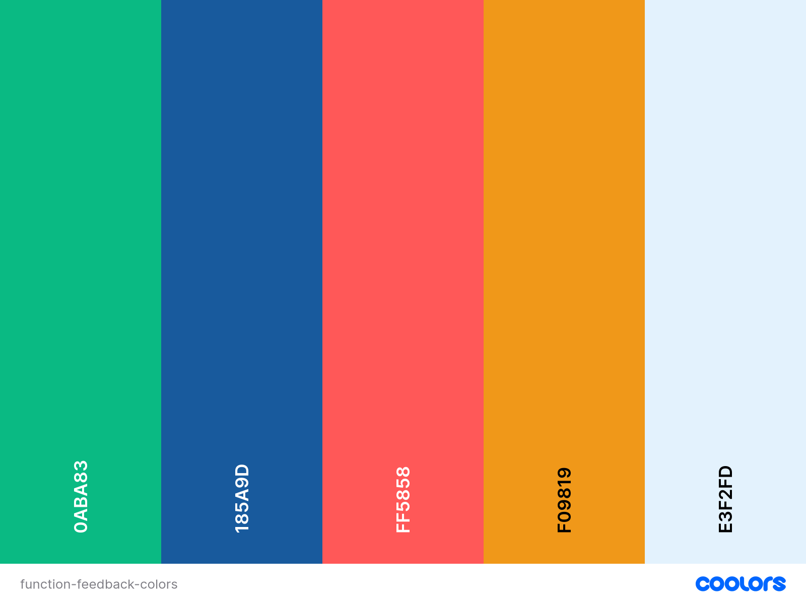
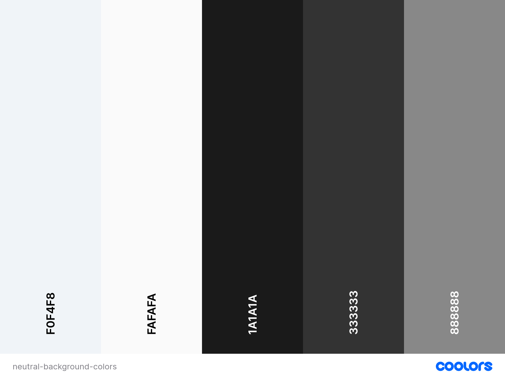
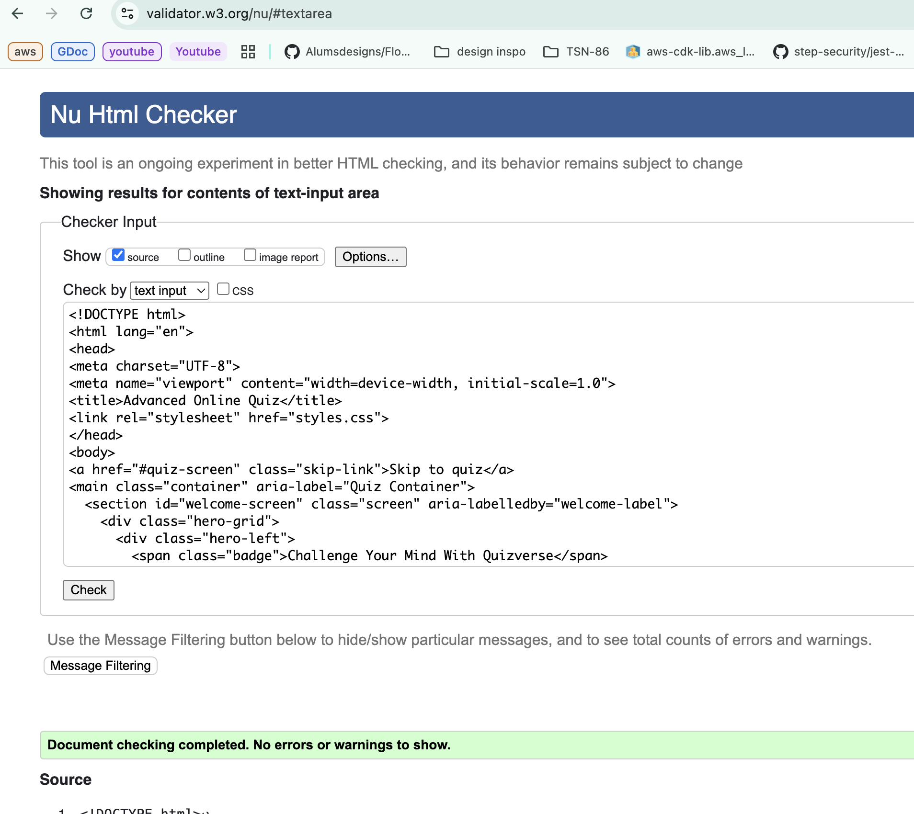
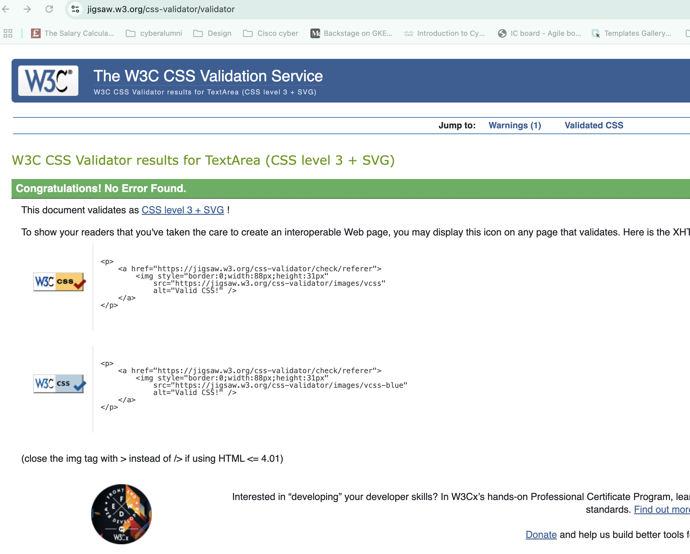

# QUIZVERSE IS AN ADVANCED ONLINE QUIZ

Advanced Online Quiz is a modern, accessible web app for testing and sharpening your general knowledge. Designed for students, lifelong learners, and anyone who loves a challenge, it's features a responsive, mobile-friendly interface and a fun, interactive quiz experience. The site is a single-page application that works on all devices and is easy to use for everyone.

The primary audience includes students, quiz enthusiasts, and anyone looking to learn or test their general knowledge in a friendly, accessible environment.



[View deployed Website "Advanced Online Quiz"](https://YOUR-DEPLOYED-LINK-HERE)

# Contents
1. [User Experience (UX)](#1-user-experience-ux)
    - [User Stories](#user-stories)
        - [Site Users](#site-users)
        - [Site Owner](#site-owner)
2. [Features](#2-features)
    - [Current Features](#current-features)
    - [Future Features](#future-features)
3. [Design](#3-design)
4. [Technologies Used](#4-technologies-used)
5. [Testing](#5-testing)
6. [Deployment and Local Development](#6-deployment-and-local-development)
7. [Credits](#7-credits)

---

# 1. User Experience (UX)

## User Stories

### Site Users
As a quiz taker:
- I want to easily start a quiz and enter my name, so I feel personally engaged.
- I want to take high-quality general knowledge quizzes that cover a wide range of topics like TV, history, geography, science, etc, so that I can test and improve my trivia skills and get ready for pub quizzes or quiz show.
- I want to see instant feedback after each question, so I know if I was correct.
- I want a timer for each question, so the quiz feels challenging and fun.
- I want to see my score at the end, so I can measure my performance.
- If I get a perfect score, I want a special congratulations message and effect.
- I want to be able to restart the quiz and try again.
- I want the quiz to be accessible and usable on any device I own.

### Site Owner
As the site owner:
- I want the quiz to be easy to use and visually appealing, so users enjoy the experience.
- I want the site to be accessible to all users, including those using assistive technology.
- I want to retain users 
- I want to encourage the user's to retake the quiz.
- I want to provide good quality questions.
- I want user to have fun as they quiz 
- I want users to learn as they go


---

# 2. Features

### Current Features

- __F01 Input Element__ The Input element allows Users to enter their name to start the quiz. It has a clear call to action within the box and above it.
[Input Element](assets/images/input-element.png)

- __F01 Input Element & User Validation__
    - Users must enter their name to start the quiz.
    - Name input has built-in real-time validation (length, allowed characters, security checks).
    - Instant, accessible error messages guide users for invalid input.
    - All input fields and buttons are keyboard accessible and screen reader friendly.
    - Clear call to action in the label and button.
    The Input element allows Users to enter their name to start the quiz. It has a clear call to action within the box and above it.
    [Input Element Validation Example](assets/images/input-validation-example.png)

- __Timed Questions__
    - Each question features a visible countdown timer for added challenge.

- __Urgency Timer Indicator__  
    - The countdown timer flashes red and highlights urgency when time left is below 10 seconds, encouraging timely responses.

- __Instant Feedback__
    - Users immediately see if their answer was correct or not, with color-coded messages and encouraging explanations.

- __Progress Tracking__
    - Shows the current question number out of total (e.g., "Question 7 of 30").
    - Dynamic progress bar with percentage correct.

- __Close (X) Button for Quiz Screen__  
    - Allows users to exit the quiz and return to the welcome screen at any time.  
    - Fully accessible with keyboard support and screen reader-friendly labels.  
    - Includes hover and focus visual feedback for clear usability.

- __Animated Congratulations__
    - Special animation and message for perfect (100%) scores.
    - Encouragement messages for high, average, and lower scores.

- __Restart Option__
    - Users can retake the quiz immediately after finishing.

- __Skip Link__
    - Quick keyboard navigation for screen reader and keyboard users.

- __Accessibility__
    - Form error/status messages announced to assistive technologies.
    - Proper ARIA roles, high color contrast, full focus control, keyboard navigation.

- __Responsive Design__
    - Fully responsive UI for mobile, tablet, and desktop.


### Screens
### Welcome Screen  

- The welcome page is the entry point, designed to engage users and provide a clear call to action.

- **User Input:** An input field allows users to enter their name, making the quiz a personalized experience.

- **Form Validation:** The input field includes client-side validation to ensure a valid name is entered before the quiz can start. An active error message with a "shake" animation provides clear feedback.

- **Responsive Hero Section:** A visually appealing hero section with a title and a descriptive paragraph gives users a brief overview of the quiz. A floating illustration adds a subtle, modern touch.

- **"Start Quiz Now"** Button: A prominent button guides users to start the quiz once their name is entered.


### Quiz Screen
- This is the main interactive section of the app, built to be engaging and user-friendly.

- **Question and Choices:** Displays one question at a time with multiple-choice answers that are clear and easy to select.

- **Next Question Button:** The button to advance is initially hidden and only appears after a user has selected an answer. This ensures users receive and process feedback before moving on.

- **Instant Feedback:** After a user selects an answer, the app provides immediate feedback, indicating whether the choice was correct or incorrect. With add general knowledge quote.

- **Progress Tracking:** Users can see their progress through the quiz with a progress bar and a question counter (e.g., "Question 5 of 10").

- **Countdown Timer:** Each question includes a timer to add an element of challenge. The timer flashes a warning color when time is running out.

- **Close Button:** A universal "X" button is available on the quiz screen, allowing users to exit the quiz at any time and return to the welcome screen. 

Coorect answer image example:



Incorrect answer image example with alert red:



### Result Screen 

- The final screen provides a summary of the user's performance and an opportunity to retake the quiz.

- **Final Score:** Displays the user's total score after all questions have been answered.

- **Animated Congratulations:** If a user achieves a perfect score, a special celebratory message with a "pop-in" animation and emoji is displayed.

- **Restart Option:** A prominent "Restart Quiz" button allows users to easily play again, encouraging repeat visits.


### Additional Features
- **Accessibility:** The site is designed with accessibility in mind, including a skip link for keyboard navigation, clear focus states, and ARIA attributes for screen reader support.

- **Responsive Design:** The layout is fully responsive and optimized for a consistent user experience on mobile, tablet, and desktop devices.

- **Visual Design:** The site uses a consistent and appealing color palette, with elegant typography and subtle animations to enhance the user interface

### Future Features
In the future we could add the following features
- More question categories and difficulty levels
- Offer engaging quizzes that encourage repeat visits.
- High score leaderboard
- User authentication for saving progress
- Enhanced accessibility features e.g., color & themes.
- Audio feedback and sound effects
- Ensure accuracy and clarity of questions and answers.
- Regularly update quizzes to keep them fresh and relevant.
- Monitor how many quizzes are taken, scores, and retention.
- Track which topics are most popular or need improvement.
- Encourage users to share and recommend the platform.


---

# 3. Design
## Structure
The app is a single-page application with three main views: Welcome, Quiz, and Results. All views are accessible and responsive.

## Wireframes
- [Welcome Screen Wireframe](assets/images/wireframe-welcome-page.png)
- [Quiz Screen Wireframe](assets/images/wireframe-2.png)
- [Quiz Progress 1 Screen Wireframe](assets/images/wireframe-3.png)
- [Quiz Progress 2 Screen Wireframe](assets/images/wireframe-congrates1.png)
- [Result Screen Wireframe](assets/images/wireframe-congrates2.png)


## Colour Scheme
#### Primary and Secondary Colors 

#### Functional and Feedback Colors

#### Neutral and Background Colors


The color palette was chosen for high contrast and readability, ensuring accessibility for all users.

## Typography

- Font Import: Your CSS imports three Google Fonts: Lato, Playfair Display, and Roboto.

- Font Stacks: Each font stack includes a system font fallback (Arial, Helvetica, sans-serif, or serif) to ensure fast loading and readability even if the Google Font fails to load.

- Main Font (Lato): Used for the body text, making it a highly readable and modern sans-serif font for general content.

- Heading Font (Playfair Display): Used for headings (h1, h2, h3, h4, h5, h6) and paragraphs (p), giving the site a distinct and elegant serif style.

- Buttons & Choices Font (Roboto): Applied to buttons and quiz choices, providing a clean, clear, and easy-to-read sans-serif style for interactive elements.

## Imagery

All images and icons are designed to be clear and accessible. 
![Images] 

---

# 4. Technologies Used
- HTML5
- CSS3
- JavaScript
- [Chrome DevTools](https://developer.chrome.com/docs/devtools/)
- [Git](https://git-scm.com/)
- [GitHub](https://github.com/)
- [coolors](https://coolors.co/)
- [W3schools](https://www.w3schools.com/)
- [Canva](https://www.canva.com/en_gb/)
- [Figma](https://www.figma.com/)
- [GoogleFonts](https://fonts.google.com/)
---

# 5. Testing

This project was tested for:
- Functionality and usability on Chrome, Firefox, Safari, and Edge
- Accessibility using keyboard navigation and screen readers
- Responsiveness on mobile, tablet, and desktop
- HTML and CSS validation using W3C tools


### HTML Validation
All HTML validation issues have been resolved:
-  Removed trailing slashes from void elements (`<meta>`, `<link>`, `<input>`, ``, `<line>`)
-  Removed unnecessary `role="region"` from `<section>` elements
-  Fixed invalid `role="group"` on form elements
-  Added content to empty heading elements
-  Removed potentially misused `aria-label` attributes

| Test | Screenshot |
|------|------------|
| HTML Validation |  |
| HTML Validation |  |

### CSS Validation
- All CSS validation passed without errors:


| Test | Screenshot |
|------|------------|
| CSS Validation |  |


### Manual User Testing Table

| Test Case ID | Test Description                                      | Input Data           | Expected Result                                                                 | Actual Result | Pass/Fail |
|--------------|--------------------------------------------------------|----------------------|----------------------------------------------------------------------------------|---------------|-----------|
| TC01         | Enter user name and start quiz                         | "Damaris"            | Quiz starts and welcome message includes user’s name                             | As expected   | Pass      |
| TC02         | Submit answer before timer ends                        | Correct/Incorrect    | Feedback shown instantly ("Correct"/"Incorrect") and next question appears       | As expected   | Pass      |
| TC03         | Wait for timer to run out without answering            | No input             | Timeout message shown and question marked incorrect                              | As expected   | Pass      |
| TC04         | Complete all questions                                 | All answers          | Score and result screen shown, includes restart option                           | As expected   | Pass      |
| TC05         | Get perfect score                                      | All correct answers  | Congratulations message and animation shown                                      | As expected   | Pass      |
| TC06         | Click "Restart" on result screen                       | Click restart button | Quiz resets and returns to welcome screen                                        | As expected   | Pass      |
| TC07         | Navigate entire quiz using keyboard only               | Tab, Enter keys      | Full quiz is operable via keyboard                                               | As expected   | Pass      |
| TC08         | Use screen reader for quiz                             | Screen reader on     | All interactive elements are announced and labeled correctly                     | As expected   | Pass      |
| TC09         | Resize window for responsiveness                       | Mobile & Desktop     | Layout adapts to different screen sizes                                          | As expected   | Pass      |
| TC10         | Test input field validation                            | Empty or invalid     | Alert shown if name field is left blank                                          | As expected   | Pass      |
| TC11         | Accessibility: Skip link focus test                    | Press Tab key        | Skip link is visible and allows user to skip to main content                     | As expected   | Pass      |
| TC12         | Refresh page mid-quiz                                  | Browser refresh      | Page resets, quiz starts from welcome screen                                     | As expected   | Pass      |
| TC13         | Browser compatibility                                  | Chrome, Firefox, etc | Site works correctly in all major browsers                                       | As expected   | Pass      |
| TC14         | CSS and animation effects on result                    | Finish quiz          | Animations load smoothly without lag                                             | As expected   | Pass      |
| TC15         | Accessibility: Color contrast and font readability     | Visual check         | All text has sufficient contrast and readable font sizes                         | As expected   | Pass      |


### Browser Compatibility

- Testing has been carried out on the following browsers :
    - Chrome Version 90.0.4430.212 (Official Build) (64-bit)
    - Firefox Version 88.0.1 (64-bit)
    - Edge Version 90.0.818.62 (Official build) (64-bit)
    - Safari on macOS Catalina (Safari  Version 14.0.3)


---


# 6. Deployment and Local Development

## Deployment
The site is deployed on GitHub Pages.

[View deployed site](https://YOUR-DEPLOYED-LINK-HERE)

## Local Development
1. Clone the repository:
   ```bash
   git clone https://github.com/Alumsdesigns/quizverse.git
   cd quiz-project
   ```
2. Open `index.html` in your browser. No build step required.

- Deplyment was deplayed on github due to global github maintanence the end of May 2025 and github pages still isn't back to optimal performance with site launches taking 12hurs+ as of June 2025see [Githubs announcements](https://www.githubstatus.com/) the end of Amy
- [View on githib pages](https://alumsdesigns.github.io/davinaleilaniblooms/) 

### How this site was deployed

- In the GitHub repository, navigate to the Settings tab, then choose Pages from the left hand menu 
- From the source section drop-down menu, select the Master Branch
- Once the master branch has been selected, the page will be automatically refreshed with a detailed ribbon display to indicate the successful deployment
- Any changes pushed to the master branch will take effect on the live project


---

# 7. Credits

## Code
- Custom code by Damaris Alum.

## Content
- All quiz questions and content written by Damaris Alum.

## Media
- All screenshots and images are original or sourced from free resources.
- Quiz hero image by Kohji Asakawa from Pixabay.  
  [Pixabay profile](https://pixabay.com/users/kohjiasakawa-1203821/)  

## Acknowledgements
- Thanks to MDN, W3Schools, and WebAIM for accessibility guidance.

---

# 8. Best Practices

## Development Standards

### Accessibility
- **ARIA Compliance**: All interactive elements include proper ARIA attributes
- **Screen Reader Support**: Error messages and progress updates are announced
- **Keyboard Navigation**: Full keyboard accessibility with visible focus indicators
- **Semantic HTML**: Proper use of roles, labels, and semantic elements

### Security
- **Input Validation**: Comprehensive client-side validation with security patterns
- **XSS Prevention**: HTML entity encoding and tag removal
- **SQL Injection Protection**: Pattern detection for malicious input
- **Input Sanitization**: All user input is sanitized before processing

### User Experience
- **Real-time Feedback**: Immediate validation without page reloads
- **Progressive Enhancement**: Works without JavaScript, enhanced with it
- **Responsive Design**: Mobile-first approach with desktop enhancements
- **Performance**: Optimized animations and efficient DOM manipulation

### Code Architecture
- **Modular Design**: Separated concerns with reusable functions
- **Configuration-Driven**: Easy to modify validation rules and messages
- **Error Handling**: Comprehensive error catching and user feedback
- **Maintainable Code**: Clear structure with consistent patterns

### Browser Compatibility
- **Cross-Browser Support**: Tested on Chrome, Firefox, Safari, Edge
- **Mobile Responsive**: Optimized for all screen sizes
- **Progressive Web App Ready**: Can be easily converted to PWA

## 9. Technical Implementation

### Validation System
- **Configuration object** for easy maintenance
- **Modular validation functions** for testability
- **Real-time feedback** with smooth animations
- **Security-first approach** with comprehensive threat prevention

### Responsive Design
- **Desktop-first** with mobile optimizations
- **Flexible layouts** that adapt to screen size
- **Touch-friendly** interface elements
- **Performance optimized** for mobile devices

### Accessibility Features
- **Focus management** for keyboard users
- **Screen reader announcements** for dynamic content
- **High contrast** error messages
- **Semantic structure** for assistive technology

## Acknowledgements
- Thanks to code institute and w3schools for their support